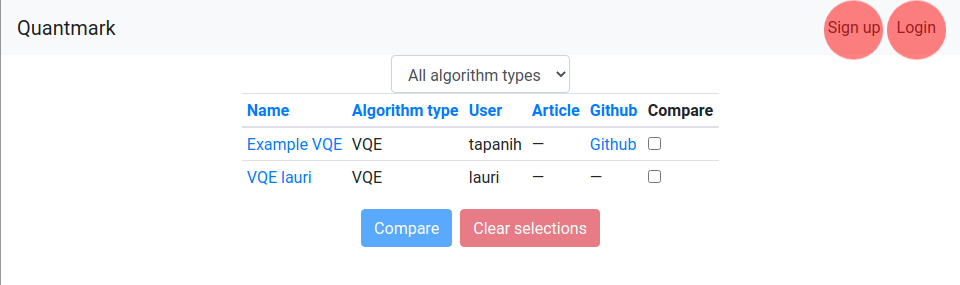
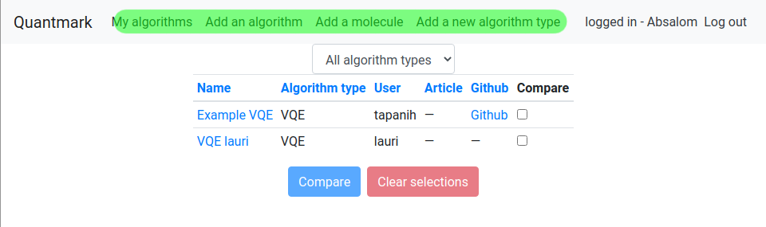
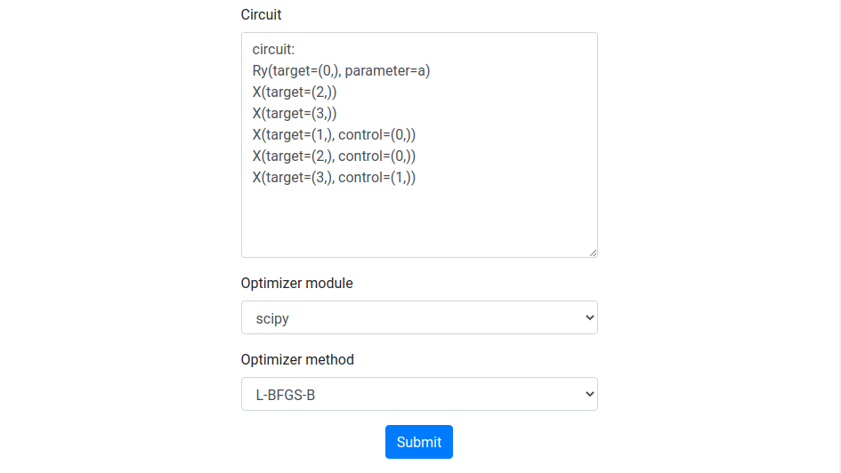
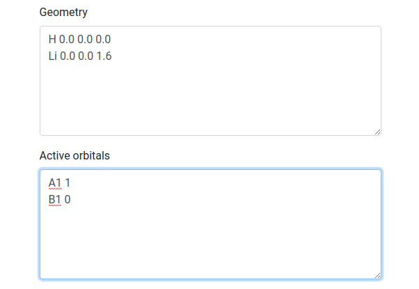
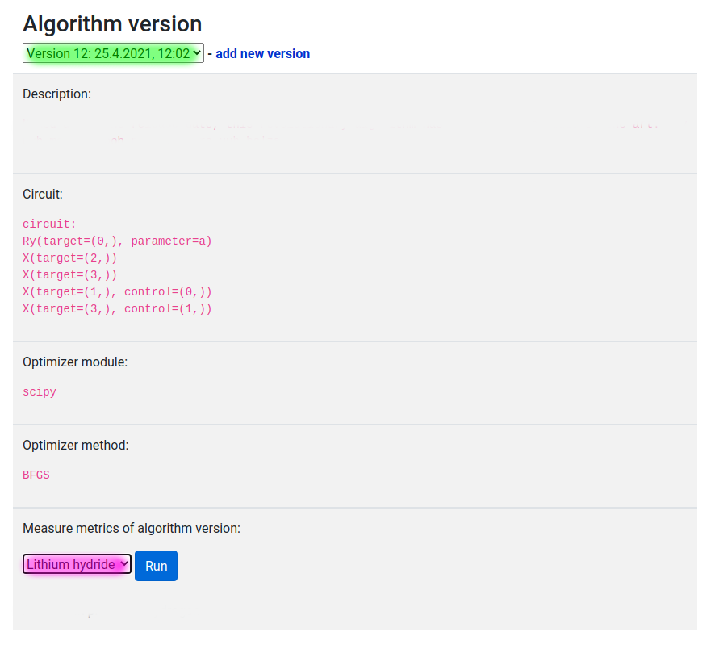

# Manual
## Prerequisites
- For online use: [QuantMark](https://ohtup-staging.cs.helsinki.fi/quantmark/)
- For local use, install with Docker (recommended): [WebMark/Readme.md](https://github.com/ohtu2021-kvantti/WebMark#readme)
## How to use
### Without logging in
On the main page, the user can compare the results of the selected algorithms, and inspect individual public algorithms listed on the main page. Algorithms can be sorted according to type.

Signing up / logging in is selected from the upper right corner.
### Logged in
Highlighted on green are the selections for adding a new algorithm, molecule, or algorithm type. The user's own algorithms are listed in "My algorithms".

When adding a new algorithm, the circuit must be input in the same syntax as tequila's output. 

When creating a new molecule, the geometry must be in the form of: "<Molecule> a.x b.y c.z". Active orbitals must be listed as f.ex. "A1 1 <new line> B1 0"

After a new algorithm has been written, and a new molecule has been created, the user can measure the metrics of a certain version (selectable from a dropdown menu, highlighted in green) on a particular molecule (selected from a dropdown, highlighted in pink).

The page is automatically refreshed after the benchmarking is complete.
All tasks in queue are listed below the run button:
